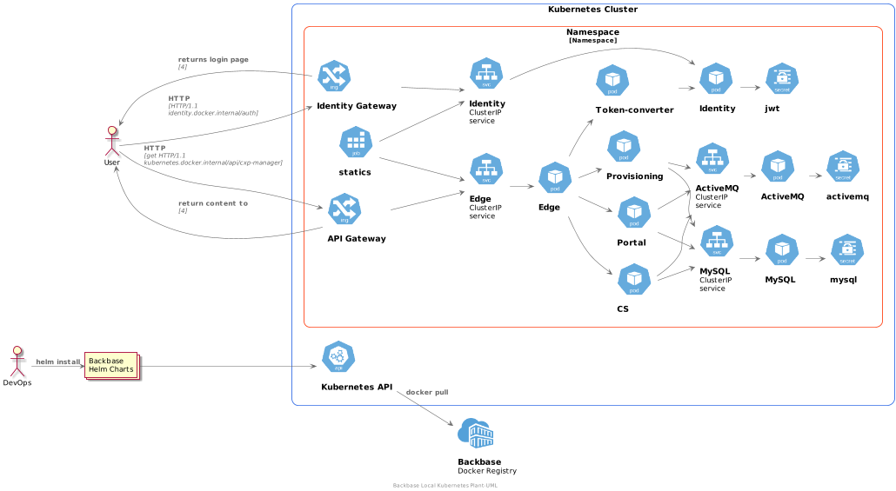

# helm-local-k8s

## Description

Local k8s Helm Chart is all in one chart that needs to spin up all a demo setup with Backbase IPS and CX6 applications

## Diagram



## Prerequisites

A Kubernetes cluster

### Docker for Desktop k8s

https://medium.com/p/kubernetes-in-local-the-easy-way-f8ef2b98be68?source=email-751ac5929c0e--writer.postDistributed&sk=1cf6c2f31d82d836a2a75503b2fb17be


Helm - https://helm.sh/docs/intro/install/
```
brew install helm
```
or for windows
```
choco install kubernetes-helm
```

## Adding Backbase Charts repo to local

Run `helm repo list` to check if `backbase-charts` and `nginx-stable` are added to your local. If not add them by running following command:
```
helm repo add nginx-stable https://helm.nginx.com/stable
helm repo add backbase-charts https://repo.backbase.com/backbase-charts --username "$username" --password "$password"
helm repo update
```
## Add Identity host
Identity will be running on a different host, so add the following in your `hosts` file:
```
127.0.0.1 identity.docker.internal
```
Location of host file in 
- Widows - `c:\windows\system32\drivers\etc\hosts`
- Mac - `/etc/hosts`

Note - `kubernetes.docker.internal` would already be present in the hosts, which is added by `Docker Desktop`.

## How to use

Update dependencies

```
helm dependency update local-k8s
```

Note - Sometimes it may be required to delete everything in charts folder.

## How to use
If you do not have the images locally please add `regcred` secret

```
kubectl create secret docker-registry regcred --docker-server=https://repo.backbase.com/backbase-docker-releases --docker-username=<your-username> --docker-password=<your-password> --docker-email=<your@email.com>
```
```
kubectl patch serviceaccount default -p "{\"imagePullSecrets\": [{\"name\": \"regcred\"}]}" -n default
```
Change `<yourRepoUsername>` and `<yourRepoPassword>` with your Repo credentials in `values.yaml`.

## Install
```
helm install bb-local local-k8s
```
## Verify
Open a browser and point to:
```
http://kubernetes.docker.internal/cxp-manager/login
```

## Configuration

All configuration is provided in values.yaml

## Changelog

- 0.0.1: Initial release
- 0.1.0: Update Edge 2 and Registry removed
- 0.2.0: Charts and App version update
- 0.4.0: Nginx chart added
- 0.5.0: Added identity with CX/IPS charts update
- 0.6.0: Backbase Bom and charts update